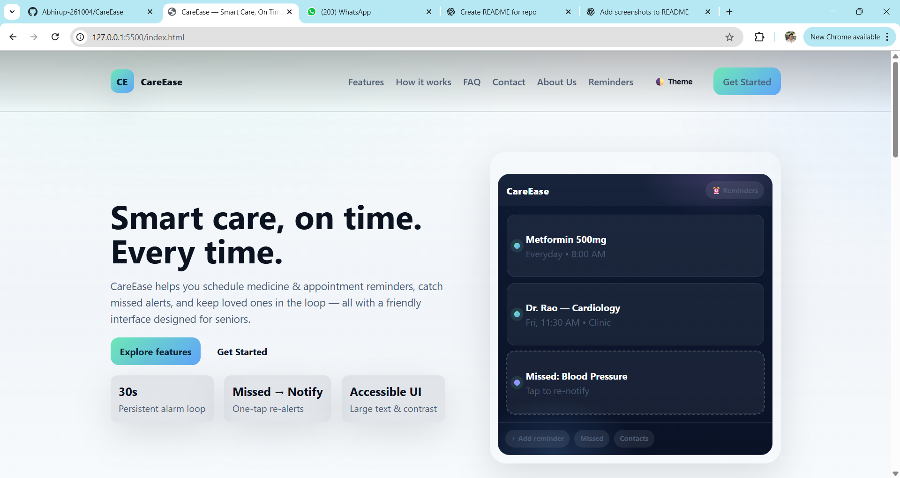
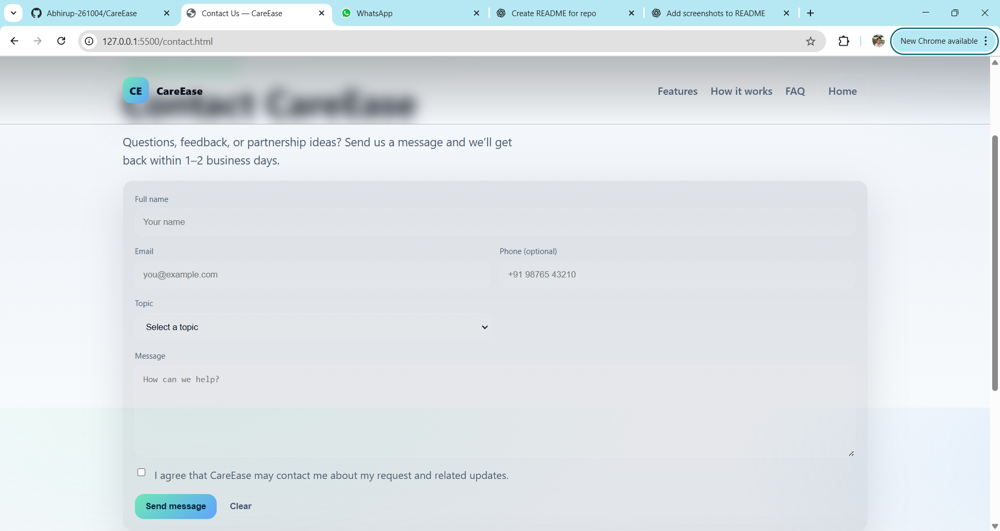
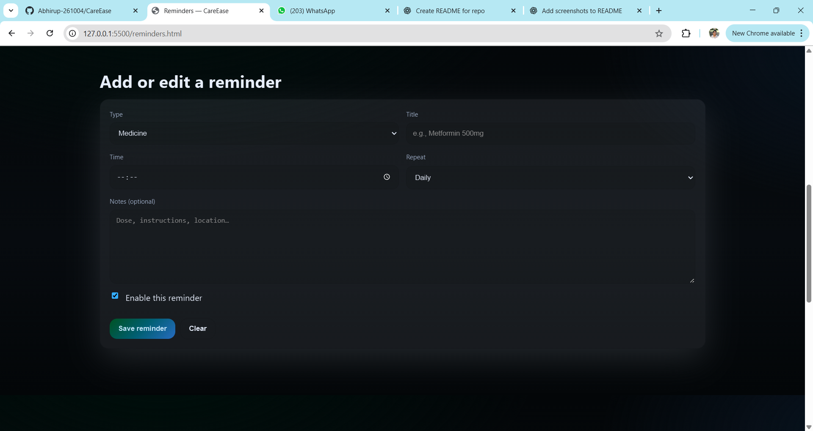
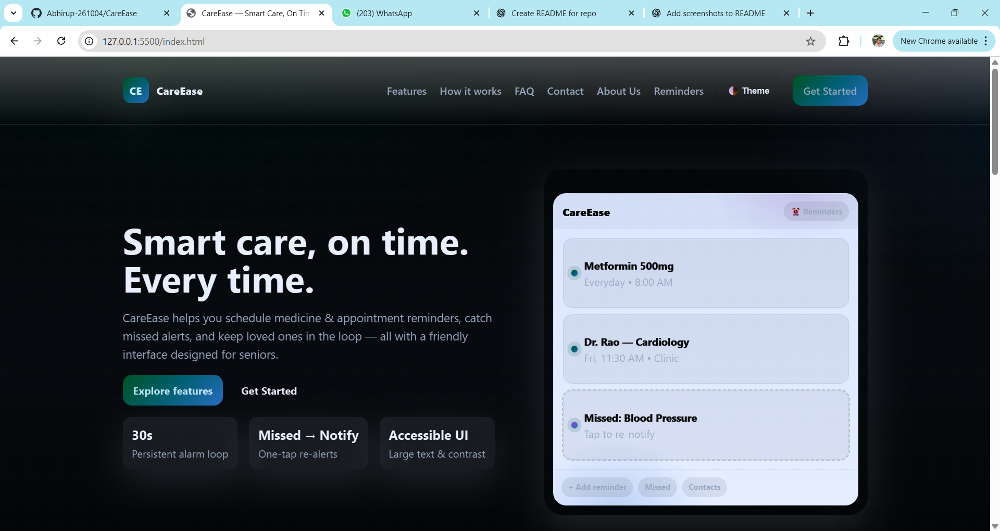

# CareEase

**CareEase** is a lightweight, front-end project for a **healthcare helper app**. It includes a modern landing page, About/Contact pages, a dedicated Auth page (Sign in / Sign up / Forgot password), and a Reminders page to help users track health tasks and appointments.


## ✨ Features

- **Modern landing page** with CTA to get started  
- **Auth flow**: Sign In, Sign Up, and Forgot Password in one page (`auth.html`)  
- **Reminders**: create and manage simple reminders (front-end only)  
- **About & Contact** pages with consistent theme  
- **Responsive UI** (HTML/CSS/JS; no frameworks)


## 🔧 Tech Stack

- **HTML5** for markup  
- **CSS3** for styling (plus `auth.css`)  
- **Vanilla JavaScript** for interactions (`/js` and `auth.js`)  
- **Assets** served locally from `/assets`


---

## 📁 Project Structure

```plaintext
CareEase/
├── .github/
│   ├── ISSUE_TEMPLATE/           # Templates for creating issues
│   └── PULL_REQUEST_TEMPLATE.md # Template for PR submissions
├── assets/                       # Images, icons, and static assets
│   ├── ContactForm.png
│   ├── DarkMode.png
│   ├── Landing.png
│   ├── Reminders.png
│   ├── logo.png
│   ├── logo.svg
│   ├── logo2.png
│   └── signup_welcome.jpg
├── css/                          # Stylesheets
│   ├── style.css
│   ├── auth.css
│   └── profile.css
├── js/                           # JavaScript files
│   ├── app.js
│   ├── contact.js
│   ├── profile.js
│   ├── reminders-localstorage.js
│   └── reminders.js
├── .gitignore                     # Files/folders to ignore in Git
├── CONTRIBUTING.md                # Guidelines for contributing
├── LICENSE                        # Project license
├── README.md                       # Project documentation
├── about.html                     # About page
├── auth.html                      # Authentication page
├── auth.js                        # Auth-related scripts
├── blog.html                       # Blog page
├── contact.html                    # Contact page
├── in.html                         # Login or sign-in page
├── license.html                    # License page
├── profile.html                     # Profile page
├── reminders.html                   # Reminders page
├── terms.html                       # Terms & Conditions page
```
---


## 🚀 Getting Started

Because this is a static site, you can run it in two simple ways:

### Option A — Open in browser

1. Download or clone the repo

   ```bash
   git clone https://github.com/Abhirup-261004/CareEase.git
   cd CareEase
   
2. Double-click index.html to open it in your browser.

### Option B — Live Server (recommended)

1. Install the Live Server VS Code extension.

2. Open the folder in VS Code → Right-click index.html → Open with Live Server.


## 🧪 Development Notes

The Auth page (auth.html) switches between Sign In / Sign Up / Forgot Password via UI tabs (handled in auth.js).
The Reminders page is front-end only. For persistence, you can:
start with localStorage, or
connect to a real API later.


## 🛤️ Roadmap

- Hook auth forms to a backend (Node/Express or Firebase)
- Persist reminders (localStorage → API)
- Form validation & toasts


## 🤝 Contributing

Contributions are welcome!

1. Fork the repo
2. Create a new branch: git checkout -b feat/your-feature
3. Commit: git commit -m "Add your feature"
4. Push: git push origin feat/your-feature
5. Open a Pull Request


## Code Style
- Keep HTML semantic (use `<main>`, `<section>`, `<nav>`, etc.) to improve accessibility and maintainable structure.
- Organize CSS with clear sections; prefer utility classes over deep nesting
- Keep JS modular and small; avoid global variables where possible


 
## Screenshots

### Landing Page


### Contact Form


### Reminders


### Dark Mode

